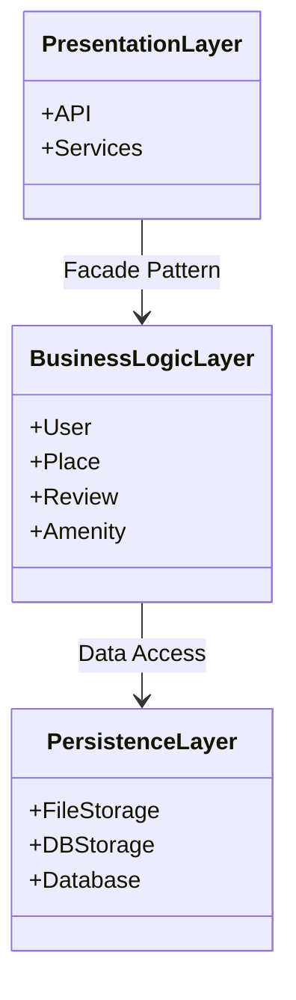
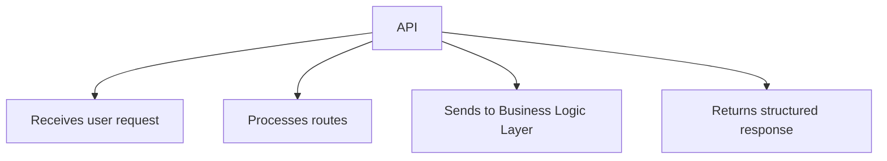
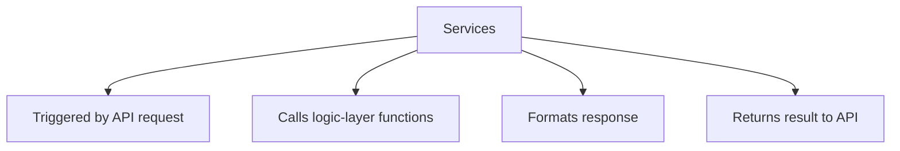
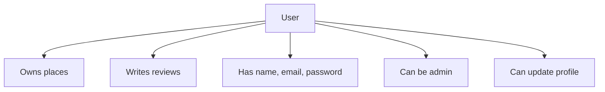
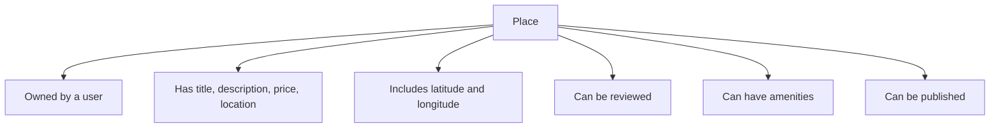
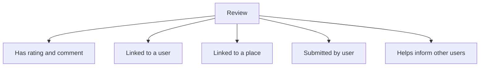
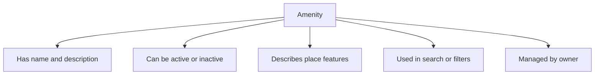
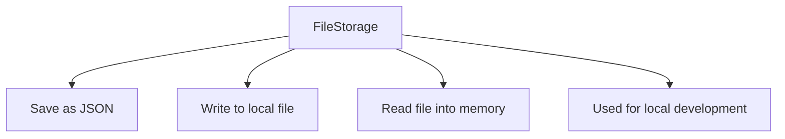
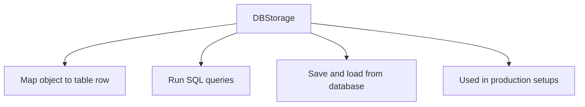

# High-Level Package Diagram



---


# Class Explanations
## Presentation Layer
### API  
The entry point of the app. It:
- Receives requests from the user or front-end
- Forwards them to the right service or logic
- Returns a structured response (usually JSON)



---
### Services  
These are the backend helpers that do the actual work after the API receives a request. Services:
- Take requests from the API and break them into logic operations
- Call the appropriate functions in the Business Logic Layer
- Handle data formatting, response generation, and sometimes validation



---
## Business Logic Layer  
### User  
Represents a person using the platform.  
- Can own one or many places  
- Can write reviews for places  
- Has personal info like name, email, password  
- May have admin privileges  
- Can update their profile


---

### Place  
Represents a property that a user can list on the platform.  
- Belongs to a specific user (the owner)  
- Has details like title, description, price, and location  
- Includes geographic data: latitude and longitude  
- Can be reviewed by other users  
- Can have connected amenities  
- Can be published for others to see


---
 ### Review  
Represents feedback that a user gives about a place.  
- Includes a rating (score) and a written comment  
- Connected to the user who wrote it  
- Linked to the place it describes  
- Helps other users decide whether to visit a place  
- Can be submitted and stored as part of the system


---

### Amenity  
Represents a feature or service that a place offers.  
- Has a name and short description  
- Can be active or inactive (turned on or off)  
- Used to describe what makes a place more comfortable or useful  
- Helps users filter or choose places with certain features  
- Can be managed by the place owner



---
## Persistence Layer
### FileStorage  
Stores and retrieves objects using local files.  
- Saves objects (like users or places) into a `.json` file  
- Converts objects into text format and writes them to disk  
- Can reload the file and turn it back into Python objects  
- Used for development, testing, or when no real database is set up



---
### DBStorage  
Connects the app to a real database system.  
- Stores objects like users or places as rows in database tables  
- Uses SQL to create, read, update, or delete data  
- Converts Python objects into database-friendly formats and back  
- Used in production when working with large or shared data



---
### Database  
Stores all the application data in structured tables.  
- Holds permanent records for users, places, reviews, and more  
- Organizes data using tables, rows, and columns  
- Only accessed through `DBStorage`, not directly by the app  
- Makes it possible to search, filter, and manage large sets of data

```mermaid
flowchart TD
    DB[Database] --> DB1[Stores data in tables]
    DB --> DB2[Contains rows and columns]
    DB --> DB3[Accessed by DBStorage]
    DB --> DB4[Holds all persistent records]

