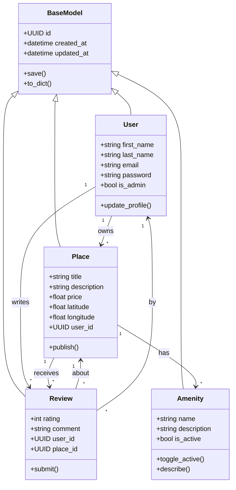
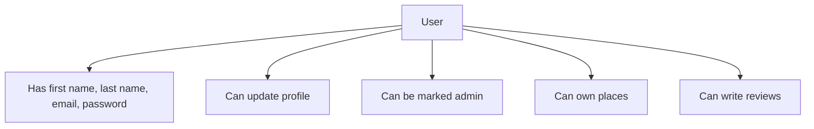
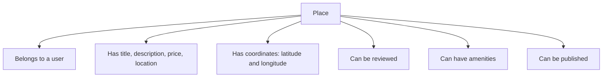
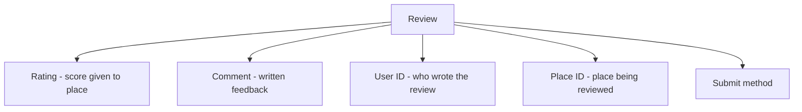
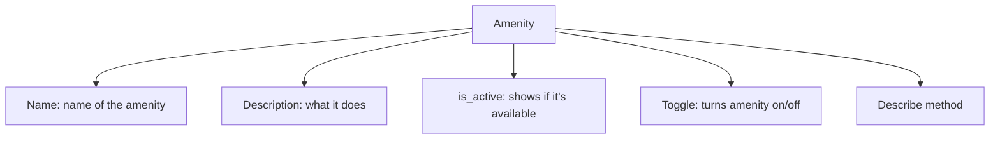

# Detailed Class Diagram



---

## Class Explanations

### BaseModel  
The main “template” for all classes. It gives:
- A unique ID  
- Creation and update timestamps  
- Methods to save or convert to dictionary

---

### User  
Represents someone using the app. A user:
- Has name, email, password  
- Can be marked as admin  
- Can update their profile  
- Can own places and write reviews  



---

### Place  
Represents a property (house or apartment). It:
- Belongs to a user  
- Has title, description, price, and location  
- Stores latitude and longitude  
- Can be reviewed  
- Can have amenities  
- Can be published  



---

### Review  
A comment a user leaves about a place. It:
- Has a rating and comment  
- Links to both user and place  
- Can be submitted  



---

### Amenity  
A feature or service offered at a place. It:
- Has a name and description  
- Can be active or inactive  
- Can describe itself  
- Can be turned on/off  



---
### Inheritance

All classes inherit from `BaseModel`, meaning they:

- Automatically get ID and timestamps  
- Have `save()` and `to_dict()` methods  

---

### Relationships

This section shows how the main classes interact:

- Users can own places  
- Users can write reviews  
- Places can have reviews  
- Places can have amenities  
- Each review is written by a user and is about one place  

```mermaid
classDiagram
    User "1" --> "*" Place : owns
    User "1" --> "*" Review : writes
    Place "1" --> "*" Review : receives
    Place "1" --> "*" Amenity : has
    Review "*" --> "1" Place : about
    Review "*" --> "1" User : by
