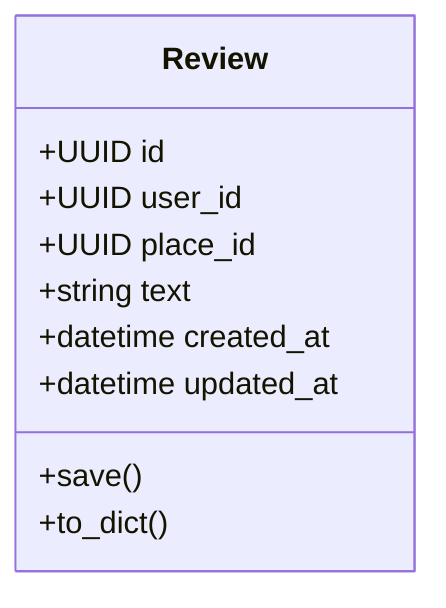
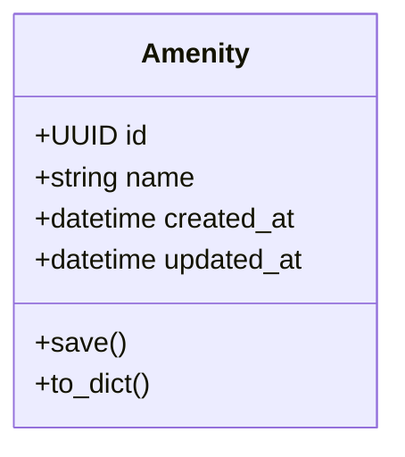
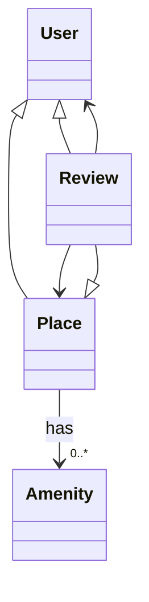
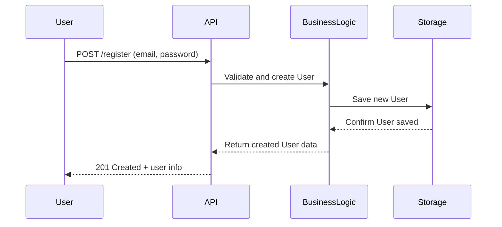
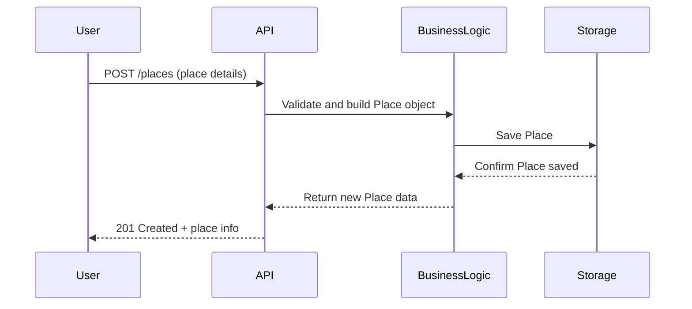
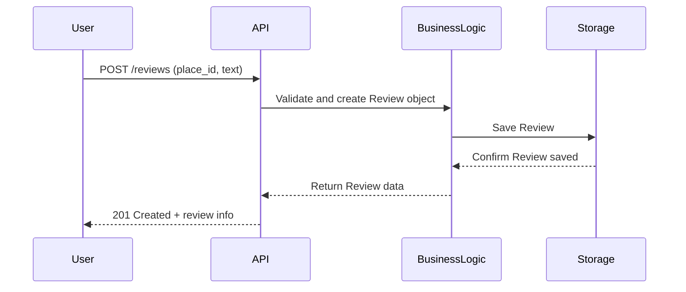
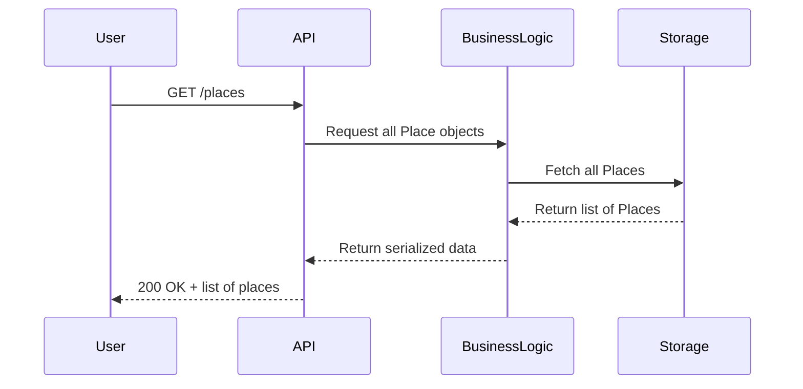

<p align="center">
  
</p>

<h1 align="center"> HBNB – Technical Documentation</h1>

<p align="center">
  This document compiles all diagrams and explanations for the architecture of the HBNB project.
</p>

---
## Table of Contents

1. [High-Level Package Diagram](#high-level-package-diagram)
2. [Business Logic Layer – Class Diagram](#business-logic-layer--class-diagram)
3. [Sequence Diagram – User Registration](#sequence-diagram--user-registration)
4. [Sequence Diagram – Place Creation](#sequence-diagram--place-creation)
5. [Sequence Diagram – Review Submission](#sequence-diagram--review-submission)
6. [Sequence Diagram – Fetching a List of Places](#sequence-diagram--fetching-a-list-of-places)

---

## 1. High-Level Package Diagram

This diagram shows the **overall architecture** of the HBNB project.  
It follows a clean 3-layer design: Presentation → Business Logic → Persistence.

```mermaid
classDiagram
class API
class Services
class Models
class DBStorage
class Database

API --> Services
Services --> Models
Models --> DBStorage
DBStorage --> Database
---

## 2. Business Logic Layer – Class Diagram

This class diagram shows the main entities in the Business Logic Layer:  
User, Place, Review, and Amenity — all inheriting from `BaseModel`.

```mermaid
classDiagram
    class BaseModel {
        +id: str
        +created_at: datetime
        +updated_at: datetime
        +save()
        +to_dict()
    }

    class User {
        +email: str
        +password: str
        +first_name: str
        +last_name: str
    }

    class Place {
        +name: str
        +description: str
        +number_rooms: int
        +price_by_night: int
    }

    class Review {
        +text: str
    }

    class Amenity {
        +name: str
    }

    BaseModel <|-- User
    BaseModel <|-- Place
    BaseModel <|-- Review
    BaseModel <|-- Amenity
---

## 3. Place Class Overview

<p align="center"></p>

The `Place` class defines properties listed on the HBnB platform. Each place is associated with a `User` (the host) and contains key details like location, pricing, and amenities.

```mermaid
classDiagram
    class Place {
        +UUID id
        +UUID user_id
        +string name
        +string description
        +string city
        +int number_rooms
        +int number_bathrooms
        +int max_guest
        +int price_by_night
        +list amenities
        +datetime created_at
        +datetime updated_at
        +save()
        +to_dict()
    }
```

####  Explanation of Fields and Methods

- **`id`**: Unique identifier for the place (UUID)  
- **`user_id`**: Links the place to the user who created it  
- **`name` / `description`**: Title and detailed info about the place  
- **`city`**: City where the place is located  
- **`number_rooms` / `number_bathrooms`**: Room/bath count  
- **`max_guest`**: Maximum number of guests allowed  
- **`price_by_night`**: Cost per night of stay  
- **`amenities`**: List of available features (like Wi-Fi, Pool, etc.)  
- **`created_at` / `updated_at`**: Timestamps for tracking changes  
- **`save()`**: Updates `updated_at` and saves the object  
- **`to_dict()`**: Serializes the object into a dictionary

---

## 4. Review Class Overview

<p align="center"></p>

The `Review` class allows users to leave feedback on places they’ve stayed at. Each review is connected to both a `User` (the reviewer) and a `Place` (the subject of the review), storing a comment and timestamps.



####  Explanation of Fields and Methods

- **`id`**: Unique identifier for the review (UUID)  
- **`user_id`**: ID of the user who left the review  
- **`place_id`**: ID of the place being reviewed  
- **`text`**: The actual content of the review  
- **`created_at` / `updated_at`**: Timestamps for when the review was made or modified  
- **`save()`**: Saves updates and refreshes the `updated_at` field  
- **`to_dict()`**: Converts the review object into a dictionary for serialization
---

## 5. Amenity Class Overview

<p align="center"></p>

The Amenity class stores the features that a place can offer, like wifi, a pool, or air conditioning. Each amenity can be linked to one or more places, helping users filter options based on what they’re looking for.



####  Explanation of Fields and Methods

- id: unique id for the amenities  
- name: The label for the feature (like "wifi", "hot tub", etc.)  
- created_at and updated_at: Timestamps that track when the amenity was created or changed  
- save(): Saves any updates and refreshes the updated_at  
- to_dict(): Turns the object into a dictionary that’s easy to send as JSON

---

---

## 6. Class Relationships Summary

<p align="center"></p>

This part shows how all the classes in the business logic layer connect and work together. Each user can create places and leave reviews. Places are linked to both amenities and reviews, and each review points back to both a user and a place.



####  How everything connects

- A user can create many places  
- A user can leave many reviews  
- A place can receive many reviews  
- A place can offer many amenities  
- A review always links to one user and one place
---

## 7. Sequence Diagrams Overview

<p align="center"></p>

Sequence diagrams show how the system handles different api calls from start to finish. They break down the flow between the user (frontend), the API (services), the business logic (models), and the storage layer. Each diagram in this section highlights a specific user action and how it moves through the app.

### What You’ll See in the Next Parts

- Who starts the action, usually a user or client  
- What route the request follows through the system  
- Which parts of the app do the heavy lifting  
- When and where the response is built and sent back

---
## 8. User Registration Sequence

<p align="center"></p>

This diagram shows how a new user signs up through the system. It starts when the user fills out the registration form on the frontend and ends when their info is saved in the database.



####  Step-by-Step Description

- User fills out the form and hits "Register"  
- The API receives the POST request  
- Business logic checks if everything is valid and creates the user  
- The new user is saved into storage  
- Once saved, the system responds with success and the user’s info

---
---

## 9. Place Creation Sequence

<p align="center"></p>

This sequence shows what happens when a user creates a new place on the platform. It walks through how the data flows from the user all the way into the database.



#### Breaking down the Actions Taken

- User fills in the form with info like name, city, price, etc.  
- API receives the data and sends it to the business logic  
- Business logic builds a new Place object and checks it  
- Place gets saved to storage  
- System responds with confirmation and the created Place details

---

---

## 10. Review Submission Sequence

<p align="center"></p>

This diagram covers how a user submits a review for a place they stayed at. It follows the review from the frontend all the way to being saved and returned.



#### Action Breakdown

- User writes a review and submits it  
- API passes the review info to the business logic  
- Business logic creates the Review object and links it to user/place  
- Review gets stored in the database  
- Response confirms the review was added successfully

---

## 11. Fetching Places Sequence

<p align="center"></p>

This sequence shows what happens when a user requests a list of available places. The system receives a GET request, pulls data from storage, and sends it back to the user as a list of places.



####  Action Breakdown

- User visits the page or sends a -get- request to see places  
- API sends the request to business logic  
- Business logic asks the storage for all place objects  
- Places are fetched and converted to dictionaries  
- Final response is returned to the user with status 200 ok

---
---

## 12. Final Summary

<p align="center"></p>

This first part of the  HBnB project explains how it's organized, how the parts connect, and how users interact with the system.

---

### Main parts of the project

**Presentation Layer**  
Handles user requests through the *API*. This is where things like registering, creating a place, or posting a review start.

**Business Logic Layer**  
Defines how the system behaves. This is where the main classes live, including User, Place, Review, and Amenity.

**Storage Layer**  
Takes care of saving and retrieving data. This could be a database or file system.

---

### What the Sequence Diagrams Show

Each diagram explains one user action from start to finish:

- Registering a new user  
- Creating a place  
- Submitting a review  
- Fetching a list of places

They show what happens at each step, who handles it, and how the system reacts to the user.

---

