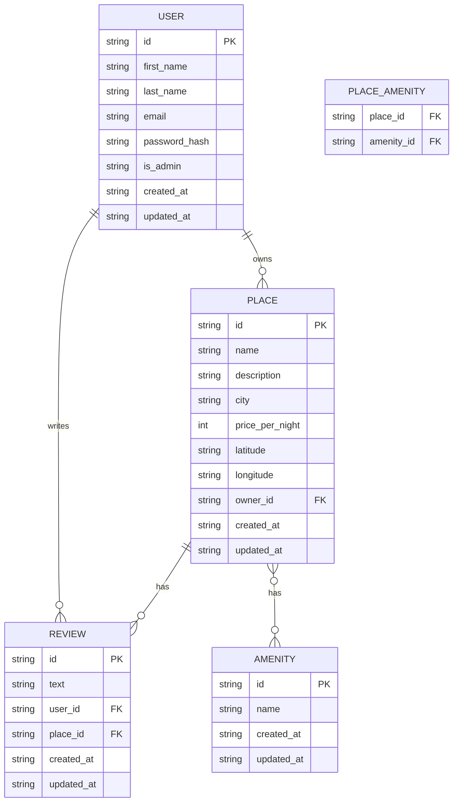

<!-- anchor for "back to top" -->

  
  
  
  
  
  
  
  

<h1 align="center">HBnB API — Part 3: Auth, Protection & Tests</h1>

<em>JWT login, role-based permissions, protected routes, and a Pytest suite that proves the API really works end-to-end.</em>

---

## Part 3 — Auth, Protection & Tests

In Part 3, the API becomes real world ready: users log in, get tokens, and only authorized people can create/update/delete data.  
We also add tests so we know everything works, not just “seems” to work.

---

### What this part adds

- Login endpoint that returns a **JWT token**
- Passwords stored as **secure hashes** (bcrypt)
- `is_admin` flag inside the JWT to control powers
- Protected routes for:
  - creating/updating/deleting places
  - creating/updating/deleting reviews
  - updating/deleting users
- Pytest test suite that checks all the rules

---

### How login and JWT work (plain language)

1. You send email + password to `/api/v1/auth/login`.
2. The API:
   - finds the user by email
   - checks password with bcrypt
   - builds a JWT token with:
     - `sub` → user id
     - `is_admin` → True/False
3. The API sends back something like:

       { "access_token": "long.jwt.string..." }

4. On the next requests, you send:

       Authorization: Bearer <token>

5. The decorators `@jwt_required()` and `get_jwt_identity()`:

   - read the token
   - reject bad/expired tokens
   - give your user id to the view
   - expose `is_admin` via `get_jwt()`

---

### Route protection rules (simple guide)

#### Users

- `POST /api/v1/users/`
  - open (no token) → register new user

- `PUT /api/v1/users/<user_id>`
  - needs JWT
  - allowed if:
    - you are that user, or
    - you are admin

- `DELETE /api/v1/users/<user_id>`
  - needs JWT
  - allowed if:
    - you are that user, or
    - you are admin

---

#### Places

- `GET /api/v1/places/`
  - open (no token) → list all places

- `POST /api/v1/places/`
  - needs JWT
  - \`owner_id\` = current user
  - normal validation: name, city, price, etc.

- `PUT /api/v1/places/<place_id>`
  - needs JWT
  - allowed if:
    - you are **owner** of that place, or
    - you are admin

- `DELETE /api/v1/places/<place_id>`
  - needs JWT
  - allowed if:
    - you are **owner** of that place, or
    - you are admin

---

#### Reviews

- `GET /api/v1/reviews/`
  - open (no token) → list all reviews

- `POST /api/v1/reviews/`
  - needs JWT
  - rules:
    - you cannot review your own place
    - one review per user per place
    - place must exist
  - \`user_id\` comes from the token, not from the payload

- `PUT /api/v1/reviews/<review_id>`
  - needs JWT
  - only the **author** can edit

- `DELETE /api/v1/reviews/<review_id>`
  - needs JWT
  - allowed if:
    - you are the **author**, or
    - you are admin

---

## Tests — what is checked (short cards)

All tests live under \`part3/tests/\`.

- \`test_auth.py\`
  - register a new user via \`/users/\`
  - reject duplicate emails
  - login returns a valid token
  - wrong password → 401

- \`test_protected.py\`
  - deny access without token
  - allow access with valid token
  - reject token with wrong signature
  - confirm \`is_admin\` claim is present in JWT

- \`test_places.py\`
  - a logged-in user can create a place
  - only owner/admin can update a place
  - only owner/admin can delete a place
  - using another user’s token gives 403

- \`test_reviews.py\`
  - guest user can create a review on someone else’s place
  - cannot review own place
  - cannot review same place twice
  - only author (or admin) can edit/delete
  - 404s when review or place doesn’t exist

These tests are your safety net.  
If \`pytest -q\` passes, the main behavior is correct.

---

## ER Diagram — HBnB Part 3 Database

This diagram shows how the main tables connect in Part 3: users own places, guests write reviews, and places are linked to amenities via a join table.

