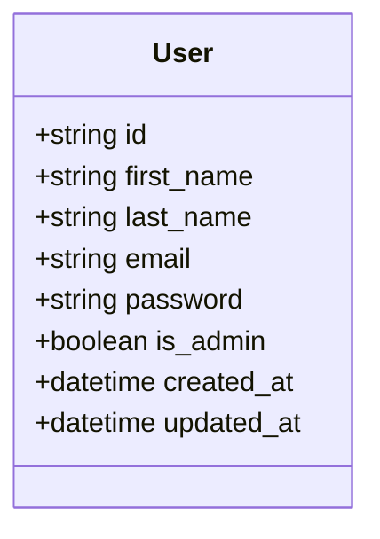
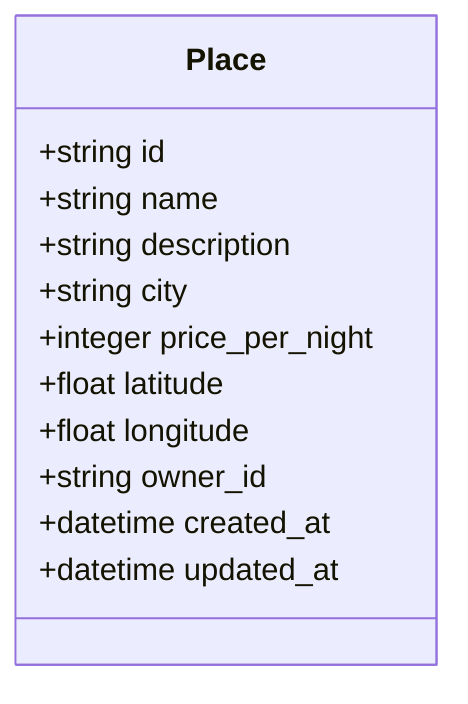
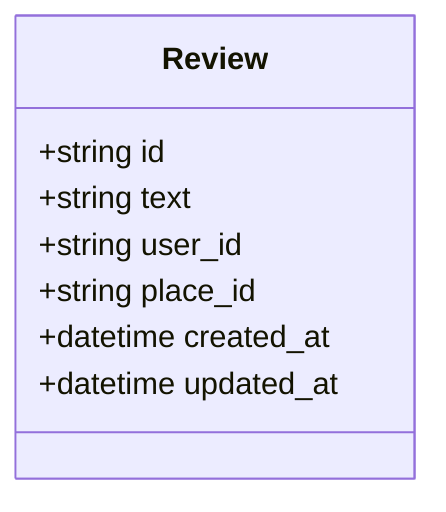
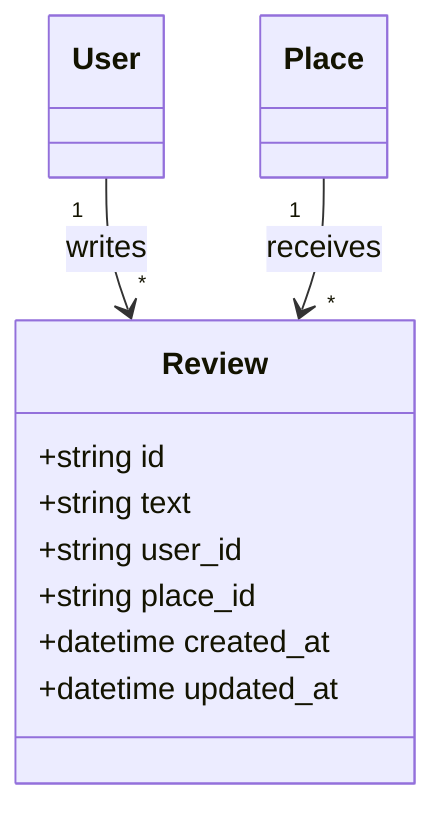
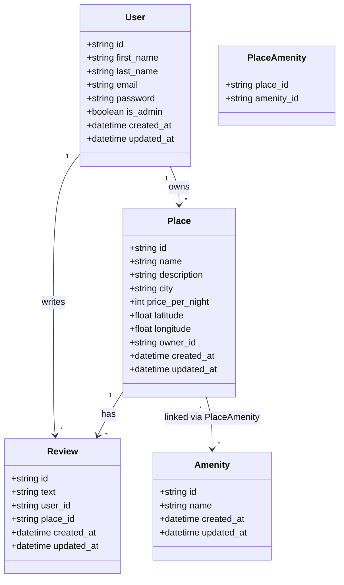

<p align="center">
  
</p>


-   `id` is the unique identifier for each user and acts as the primary key.
    
-   `first_name` and `last_name` store the user’s personal name information.
    
-   `email` must be unique and is used to identify the user or log them in.
    
-   `password` holds the hashed version of the user’s real password.
    
-   `is_admin` is a true/false value that marks if the user is an admin.
    
-   `created_at` and `updated_at` record when the user was added and last changed.
 

-   `id` is the unique ID for each place.
    
-   `name` is the public title of the place.
    
-   `description` is a longer summary of what the place offers.
    
-   `city` stores the location name.
    
-   `price_per_night` shows how much it costs to stay there per night.
    
-   `latitude` and `longitude` are the GPS coordinates for the place.
    
-   `owner_id` links this place to a user who owns it.
    
-   `created_at` and `updated_at` track when the place was added and last modified.
---

-   `id` is the unique identifier for each review.
    
-   `text` holds the content of the review that the user wrote.
    
-   `user_id` connects this review to the user who wrote it.
    
-   `place_id` connects it to the place being reviewed.
    
-   `created_at` and `updated_at` record when the review was added and last changed.
---  
```mermaid
classDiagram
    class Amenity {
        +string id
        +string name
        +datetime created_at
        +datetime updated_at
    }
 ```
 -   `id` is the primary key that uniquely identifies each amenity.
    
-   `name` describes what the amenity is (wifi, parking, and more).
    
-   `created_at` marks when the amenity was added.
    
-   `updated_at` tracks the last time the amenity was edited.
---      
```mermaid
classDiagram
    class place_amenity {
        +string place_id
        +string amenity_id
    }

    Place "1" --> "*" place_amenity : links with
    Amenity "1" --> "*" place_amenity : links with
```
-   `place_id` connects this row to a place.
    
-   `amenity_id` connects this row to an amenity.
    
-   These two fields form a bridge — a **many-to-many** relationship.
    
-   This lets one place have many amenities, and one amenity belong to many places.
---

-   `id` is the unique ID for the review.
    
-   `text` holds the feedback message or opinion.
    
-   `user_id` links to the user who wrote the review.
    
-   `place_id` connects the review to the place being reviewed.
    
-   `created_at` and `updated_at` track when the review was posted or changed.
    
-   Each user can write many reviews, and each place can receive many reviews.
---
### All Major **tables** Connected

# Relationships 
-   **User** connects to **Place** (a user can own places)
    
-   **User** connects to **Review** (a user can write multiple reviews)
    
-   **Place** connects to **Review** (a place can have many reviews)
    
-   **Place** connects to **Amenity** using a middle link (`PlaceAmenity`) to allow many-to-many features
---

